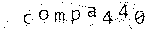
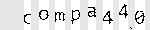
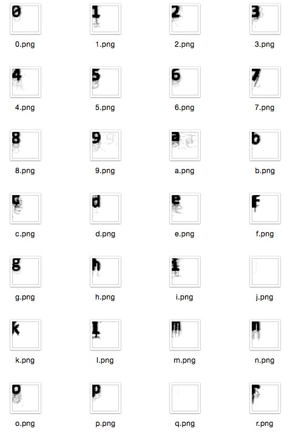

Breaking the Silk Road's Captcha
================================

[Mike A. Owens](http://mike.filespanker.com/), August 24th, 2014

Silk Road, the infamous online black market, was shut down almost a year
back.  Until moments ago, I thought it had stayed dead.  That would've made it
easier to publish this write-up, but what the hell.  I just read that it is back
in operation.  I doubt anything written here applies anymore, though.  

Regardless, I'd like to dive into some code I wrote years ago that I'm
particularly fond of, but obviously reluctant to put on a resumé.


Motivation
------------
I first heard of The Silk Road via
[gwern's writings](http://www.gwern.net/Silk%20Road) on the subject, probably
through an HN submission.  After jumping through a few Tor hoops, I was able to
check out the listings.  

Now, personally, I won't even take over-the-counter medications that are
"too blue looking", for fear that they'll make me drowsy.  But my first thought was:
Here is a bunch of interesting, real-time, market data that's hard to access
programmatically.

A [Drug Wars](http://en.wikipedia.org/wiki/Drugwars) with real-time price updates?  

A market ticker that tells you `MJ ▲0.21`, `COKE ▼3.53`?

Over time, I could collect a huge amount of historical pricing data for illicit
substances.  That's *got* to end up useful, somehow.  

No matter: I had already started imagining charts, graphs,
and `Sr::Listing` instances.  But first I had to get this login automated.

I'll be interspersing this article with what I consider interesting, albiet edited,
snippets of Ruby code.  I won't be publishing the API package, as:

  1. It probably doesn't work anymore, and I'm years removed from it.  It
     involved a lot of scraping of the site, which is always brittle.
  2. It was never really production quality, as evidenced by a lot more
     "shell outs" than I'd like.

Tor
---
The Silk Road was implemented as a TOR hidden service.  For my client API to
connect to it and do anything useful, it has to talk to Tor.

[Vidalia](https://www.torproject.org/projects/vidalia.html.en) starts a local
SOCKS5 proxy when launched.  My client needed to configure its HTTP agents to
use it.  Luckily, the [socksify gem](https://github.com/astro/socksify-ruby) allows
me to do just that.  This hacky approach changes the SOCKS proxy state of every
socket in the application after it's `auto_configure!`ed, though.


```ruby
require 'socksify'
require 'socksify/http'

module Sr

  class TorError < RuntimeError; end

  class Tor
    # Loads the torproject test page and tests for the success message.
    # Just to be sure.
    def self.test_tor?
      uri = 'https://check.torproject.org/?lang=en-US'
      begin
        page = Net::HTTP.get(URI.parse(uri))
        return true if page.match(/browser is configured to use Tor/i)
      rescue
        ;
      end

      false
    end


    # Our use case has the Tor SOCKS5 proxy running locally.  On unix, we use
    # `lsof` to see the ports `tor` is listening on.
    def self.find_tor_ports
      p = `lsof -i tcp | grep "^tor" | grep "\(LISTEN\)"`
      p.each_line.map do |l|
        m = l.match(/localhost:([0-9]+) /)
        m[1].to_i
      end
    end


    # Configures future connections to use the Tor proxy, or raises TorError
    def self.auto_configure!
      return true if @configured

      TCPSocket::socks_server = 'localhost'

      ports = find_tor_ports

      ports.each do |p|
        TCPSocket::socks_port = p
        if test_tor?
          @configured = true
          return true
        end
      end

      TCPSocket::socks_server = nil
      TCPSocket::socks_port = nil
      fail TorError, "SOCKS5 connection failed; ports: #{ports}"
    end
  end
end

```

All set.  I'd' just call that early in the process.


The Captcha
-----------

Now we get to the meat of the article: breaking the Silk Road Captcha.  

I had never done this before, so I thought it'd be interesting.  The following
is the result of two, six-hour sessions of hacking after work.

I planned on calling this a success if I could hit one-third accuracy.
I doubted so few fails would set off any alarms.  Also, the site session
would allow me to get a lot of mileage out of one successful login.

I ended up being able to do a lot better than that.

Because the Silk Road developers had to be paranoid, they couldn't use an
external captcha service like reCAPTCHA.  I'm not sure if the solution they used
was hand-rolled, or if they employed a third-party library, but lets give it a
look:


There are a few obvious features of this captcha:

  1. A regular format: a dictionary word, truncated to at most five
     characters, followed by an integer between 0 and 999.
  2. The font doesn't change, ever.
  3. Each character can be at any position on the Y axis.
  4. Each character can be rotated, but seemingly only a few degrees.
  5. The background is some sort of spiral, which doesn't contrast too much
     with the lettering.
  6. They're all awfully pink, so there's effectively one channel of color
     information.


I wrote a [Mechanize](http://docs.seattlerb.org/mechanize/) tool that downloaded
2,000 captcha examples from the site: one every two seconds.  Then I solved them
all by hand, renaming the files to *(solution)*`.jpg`.  That was not fun.

But I ended up with a pretty decent corpus of solved captchas to train or test
against.


Removing the Background
-----------------------
As good a place as any to start.  In this step, I want to end up with a
grayscale image, containing (mostly) only the characters, with the "noise"
removed.

Using The Gimp, I played around with a few effects, and a few different orders
of effects.  It took some tweaking and trial and error, but here's what I ended
up with:

Original:


Equalized:


Threshold, 0.09:



*Note: Images altered manually for illustration.*

That corresponded to the following [RMagick](http://www.imagemagick.org/RMagick/doc/) incantation:

```ruby
# Basic image processing gets us to a black and white image
# with most background removed
def remove_background(im)
  im = im.equalize
  im = im.threshold(Magick::MaxRGB * 0.09)

  # the above processing leaves a black border.  Remove it.
  im = im.trim '#000'
  im
end
```


That cleaned us up a lot, but there are still a lot of "speckles" left: little
one-pixel islands that can catch us up later, let's get rid of those:


```ruby
# Consider a pixel "black enough"?  In a grayscale sense.
def black?(p)
  return p.intensity == 0 || (Magick::MaxRGB.to_f / p.intensity) < 0.5
end


# True iff [x,y] is a valid pixel coordinate in the image
def in_bounds?(im, x, y)
  return x >= 0 && y >= 0 && x < im.columns && y < im.rows
end


# Returns new image with single-pixel "islands" removed,
#   see: Conway's game of life.
def despeckle(im)
  xydeltas = [[-1, -1],  [0, -1], [+1, -1],
              [-1,  0],           [+1,  0],
              [-1, +1],  [0, +1], [+1, +1]]

  j = im.dup
  j.each_pixel do |p, x, y|
    if black?(p)
      island = true

      xydeltas.each do |dx2, dy2|
        if in_bounds?(j, x + dx2, y + dy2) &&
            black?(j.pixel_color(x + dx2, y + dy2))
          island = false
          break
        end
      end

      im = im.color_point(x, y, '#fff') if island

    end
  end

  im
end
```

We end up with something like the following:


Awesome.

I considered taking these processed images and piping them through OCR software,
but experiments showed that approach useless.  There was more work to do.


Segmenting
----------
Now I want to slice the image up into a list of bitmaps, each holding one
character.  We travel the image, left to right, looking for blank columns.

```ruby
# returns true if column "x" is blank (non-black)
def blank_column?(im, x)
  (0 ... im.rows).each do |y|
    return false if black?(im.pixel_color(x, y))
  end

  true
end

# finds columns of white, and splits the image into characters, yielding each
def each_segmented_character(im)
  return enum_for(__method__, im) unless block_given?

  st = 0
  x  = 0
  while x < im.columns
    # Zoom over to the first non-blank column
    x += 1 while x < im.columns && blank_column?(im, x)

    # That's now our starting point.
    st = x

    # Zoom over to the next blank column, or end of the image.
    x += 1 while x < im.columns && (!blank_column?(im, x) || (x - st < 2))

    # slivers smaller than this can't possibly work: it's noise.
    if x - st >= 4
      # The crop/trim here also removes vertical whitespace, which puts the
      # resulting bitmap into its minimal bounding box.
      yield im.crop(st, 0, x - st, im.rows).trim('#fff')
    end
  end
end

```

This breaks up the image into segments like the following, horizontally:



It then crops each character to its bounding box, placing its origin at the
top-left.

I ran this process over the corpus, and generated the "average" representation
of each character, grouped by the captcha solutions I had solved.  This ended up
being a good visualization.



Think of it as a histogram.  Darker areas are where the segmentation algorithm
sliced the characters in such a way that they "agreed".  You can see offsets
where the pre-processing occasionally allowed some things slip through the
thresholds, too.

We also see how minor the effect of the tiny rotations had on the representation
of each character.  If captchas were generated with a more extreme range of
rotations, it may have been worthwhile to rotate each character bitmap until
it settles on a minimum axis-aligned bounding box.  That'd straighten them up.

On the whole, every one is pretty readable.  As the letters came from an English
dictionary, common letters are better represented (darker) than those that occur
less frequently in the language.  I use this to my advantage later.

Bet you didn't know *J* was so rare.


A Neural Network for Character Recognition
------------------------------------------
There's a cool gem for Ruby called [AI4R](http://www.ai4r.org/).  It's got
genetic algorithm implementations, Bayes classifiers, and other useful
things.  As  `Ai4r::Positronic` was not available at the time, I decided to attack
this with a neural network.

Basically, you start with an empty array of bits.  You *train* it with a
pattern and a known solution: e.g.,

  * "This pattern represents an *a*.",
  * "This different pattern also represents an *a*."  
  * "This pattern represents a *b*."

After enough examples, you can present a candidate pattern, and the network will
tell you what it *probably* represents, using its training.

There are some trade-offs.  The larger your bitstring, and the more elaborate
layer configuration, the longer training takes.  This can be significant.

I took each character in the corpus, cropped to 20x20, and applied a monochrome
threshold, to end up with a 1bpp representation, and started training.

```ruby
require 'ai4r'
require 'RMagick'

module Sr
  class Brain
    def initialize
      @keys  = *(('a'..'z').to_a + ('0'..'9').to_a)
      @ai = Ai4r::NeuralNetwork::Backpropagation.new([GRID_SIZE * GRID_SIZE,
                                                      @keys.size])
    end

    # Returns a flat array of 0 or 1 from the image data, suitable for
    # feeding into the neural network
    def to_data(image)
      # New image of our actual grid size, then paste it over
      padded = Magick::Image.new(GRID_SIZE, GRID_SIZE)
      padded = padded.composite(image,
                                Magick::NorthWestGravity,
                                Magick::MultiplyCompositeOp)

      padded.get_pixels(0, 0, padded.columns, padded.rows).map do |p|
        ImageProcessor.black?(p) ? 1 : 0
      end
    end

    # Feed this a positive example, e.g., train('a', image)
    def train(char, image)
      outputs = [0] * @keys.length
      outputs[ @keys.index(char) ] = 1.0
      @ai.train(to_data(image), outputs)
    end

    # Return all guesses, e.g., {'a' => 0.01, 'b' => '0.2', ...}
    def classify_all(image)
      results = @ai.eval(to_data(image))
      r = {}
      @keys.each.with_index do |v, i|
        r[v] = results[i]
      end
      r
    end

    # Returns best guess
    def classify(image)
      res = @ai.eval(to_data(image))
      @keys[res.index(res.max)]
    end
  end
end
```

I modified my Mechanize tool to continue downloading captchas. Only this time, it
tried to solve them, and got feedback by attempting a login.  

The captchas it got correct were added to the corpus of solutions, as a way to
self-reinforce its knowledge.

When a login attempt failed, it saved the captcha to a directory, so that I
could solve it manually.  Once the tool noticed I had renamed the file, it
slurped it up, and added it to the corpus to train upon.  Every now and then I'd
solve a few dozen captchas.

After a few hours of training, the per-character success rate was at 90%.

Unfortunately, the average captcha was nearly eight characters long, so its
successful *login rate*, considering *all* characters had to be correct, was
0.90 \*\* 8, or 43%.  My initial goal had been met, but I thought it could do better.


Exploiting the Dictionary and the Letter Frequency of English
----------------------

At times, the neural network would come up with a nonsense candidate.  Something
weird that didn't match the format.  It recognized characters independently, and
joined the results together, with no larger context.

But the "word" part of the captcha wasn't just random letters, they were
words.  Truncated words from a word list.  I have a word list, and I can
probably build one bigger than theirs with a bit of searching.  So I collected a
few and generated my master word list:

```bash
cat /usr/share/dict/words *.txt | tr A-Z a-z | grep -v '[^a-z]' \
  | cut -c1-5 | grep '...' | sort | uniq > dict5.txt
```

Then, I could assume that my `dict5.txt` contained every possible "word"
component a captcha solution would contain.  I could also consider candidates
not in my dictionary as "weird", and get on to fixing them.


```ruby
# Returns the "word" and "number" part of a captcha separately.
# "word" takes the longest possible match
def split_word(s)
  s.match(/(.+?)?(\d+)?\z/.to_a.last(2) rescue [nil, nil]
end

def weird_word?(s)
  w, d = split_word(s)

  # nothing matched?
  return true if w.nil? || d.nil?

  # Digit in word part?, Too long?
  return true if w.match /\d/ || w.size > 5

  # Too many digits?
  return true if d.size > 3

  # Yay
  return false
end

def in_dict?(w)
  return dict.bsearch { |p| p >= w } == w
end
```

But how do I fix "weird" candidate solutions, and words that didn't appear in
the dictionary?

My first thought was to look into the network's "runner up" candidates.  But
a different approach proved far more effective, as most errors were caused by bad
segmenting, not confusing similar looking letters.

Here's an interesting table:
```ruby
# a-z English text letter frequency, according to Wikipedia
LETTER_FREQ = {
  a: 0.08167, b: 0.01492, c: 0.02782, d: 0.04253, e: 0.12702, f: 0.02228,
  g: 0.02015, h: 0.06094, i: 0.06966, j: 0.00153, k: 0.00772, l: 0.04025,
  m: 0.02406, n: 0.06749, o: 0.07507, p: 0.01929, q: 0.00095, r: 0.05987,
  s: 0.06327, t: 0.09056, u: 0.02758, v: 0.00978, w: 0.02360, x: 0.00150,
  y: 0.01974, z: 0.00074
}

```

Notice our poor under-represented *J* again?

Peter Norvig has a useful article, [How to Write a Spelling Corrector](http://norvig.com/spell-correct.html).  I
had a dictionary and a probably-mispelled word.  So lets try it, with a twist:

```ruby
# This finds every dictionary entry that is a single replacement away from
# word.  It returns in a clever priority: it tries to replace digits first,
# then the alphabet, in z..e (frequency) order. As we're just focusing on the
# "word" part, "9" is most definitely a mistake, and "z" is more likely a
# mistake than "e".

def edit1(word)
  # Inverse frequency, "zq...e"
  letter_freq = LETTER_FREQ.sort_by { |k, v| v }.map(&:first).join

  # Total replacement priority: 0..9zq..e
  replacement_priority = ('0'..'9').to_a.join + letter_freq

  # Generate splits, tagged with the priority, then sort them so
  # the splits on least-frequent english characters get processed first
  splits = word.each_char.with_index.map do |c, i|
    # Replace what we're looking for with a space
    w = word.dup;
    w[i] = ' '
    [replacement_priority.index(c), w]
  end
  splits.sort_by!{|k,v| k}.map!(&:last)

  # Keep up with results so we don't end up with duplicates
  yielded = []
  splits.each do |w|
    letter_freq.each_char do |c|
      candidate = w.sub(' ', c)
      next if yielded.include?(candidate)

      if in_dict?(candidate)
        yielded.push(candidate)
        yield candidate
      end
    end
  end
end
```

The big trick here is the replacement order.  Using the table of letter
frequencies, and the list of valid dictionary words that are one edit away from
what the neural network proposed, we really want to prefer replacing a *z* before
a vowel.

This "fix-up" step took the successful login rate from 43% to 56%.  That's when
I considered it solved and called it a day.  

The experiment didn't end up going much further (and I don't have that data!), but
it was a nice stroll around a few problem domains.

\- [mieko](http://mike.filespanker.com/)

About the Author
----------------
Mike is amazing, and sometimes accepts well-paying, remote, software gigs.

 * [@leetliekmiek](https://twitter.com/leetliekmiek)
 * [/u/miekao](http://www.reddit.com/user/miekao/)
 * mike@filespanker.com
